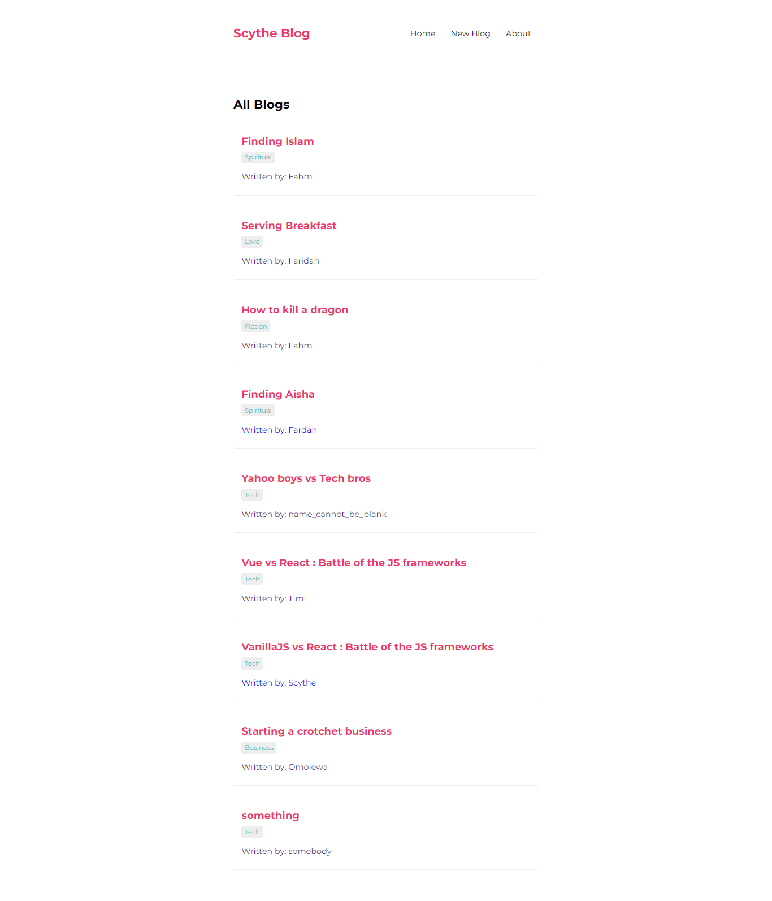

> ## Scythe Blog App


#### Link to the live website:
>[Blogapp](https://devscytheblogapp.netlify.app/ "taskapp live site")
___

#### Description 
>Scythe Blog App is a web app made with React for reading, posting and deleting blog posts. 
____

#### Tech Used:
 >React, git, github, Netlify.
___

> #### Things i have learnt : how to filter through an Array to get certain keyword
```JavaScript
// How to make component, use Hooks, make custom hooks, make json request and so on...
import Navbar from './Navbar';
import Home from './Home';
import Create from './Create';
import { BrowserRouter as Router, Route, Switch } from "react-router-dom";
import BlogContent from './BlogContent';
import NotFound from './NotFound';


function App() {
  return (
    <Router>
      <div className="App">
        <Navbar />
        <main>
          <Switch>
            <Route exact path="/">
              <Home />
            </Route>
            <Route path="/Create">
              <Create />
            </Route>
            <Route path="/blogs/:id">
              <BlogContent />
            </Route>

            <Route path= "*">
              <NotFound />
            </Route>

          </Switch>
        </main>
      </div>
    </Router>    
  );
}

export default App;

import { useState, useEffect } from "react";

const useFetch = (url) => {

    const [data, setData] = useState(null);
    const [pending, setPending ] = useState(true);
    const [error, setError ] = useState(null);

    useEffect(() => {
        const abortCont = new AbortController;
        setTimeout(() => {
            fetch(url, { signal: abortCont.signal })
                .then(res => {
                    if(!res.ok) {
                        setPending(false);
                        setError(true);
                        throw Error('could not fetch data from server!');
                    }

                    return res.json();
                })
                .then(data => {
                    setData(data); 
                    setPending(false);
                    setError(null);
                })
                .catch(err => {
                    // console.log(err.name)
                    if(err.name === 'AbortError') {
                        console.log('fetch aborted');
                    } else {
                        setPending(false);
                        setError(err.message);
                    }
                    
                });

        }, 1000);

        return () => abortCont.abort();

    }, [url])

    return { data, pending, error };
}

export default useFetch;

```
---

> #### Desktop View



> #### Credits: 
NetNinja
Scythe
# Getting Started with Create React App
### `npm start`

Runs the app in the development mode.\
Open [http://localhost:3000](http://localhost:3000) to view it in your browser.


